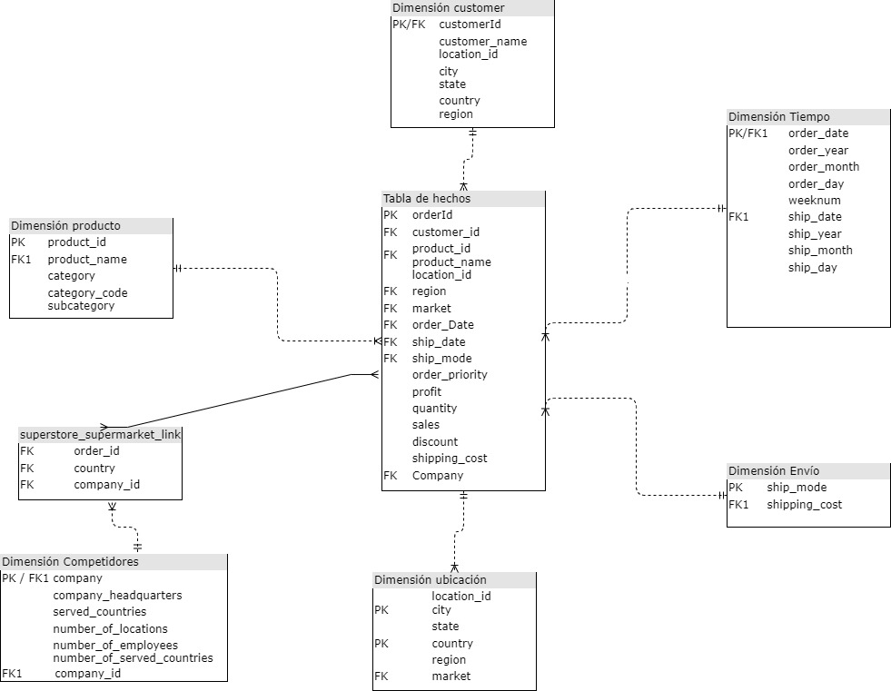

# Proyecto5_ETL
Proyecto Profundización: Estructura de datos

## Objetivo

El objetivo de este análisis es diseñar e implementar un sistema ETL (Extract, Transform, Load) robusto para Super Store que permita la extracción, transformación y carga eficiente de datos desde diversas fuentes en un almacén de datos estructurado con tablas de hecho y dimensiones. Este sistema tiene como finalidad optimizar el almacenamiento de datos y mejorar la capacidad de la empresa para identificar patrones, tendencias y oportunidades de mercado, lo que le permitirá adaptarse rápidamente a cambios en la demanda, mejorar la eficiencia operativa, y mantener una ventaja competitiva en el mercado.

## Herramientas y Lenguajes

- Google BigQuery
- Google Colab
- Power BI o Python en Google Colab.
- Lenguaje SQL en BigQuery, y Python en Google Colab
- Drawio

## Revisión de Nulos
Puedes revisar la consulta [aquí](SQL/nulls.sql).

Tras realizar un análisis exhaustivo del dataset superstore, no se encontraron valores nulos en ninguna de las variables.

## Revisión de Duplicados

Durante el análisis de nuestro dataset, se identificó que varias variables se repiten en la tabla.
Puedes revisar la consulta [aquí](SQL/duplicates_customerID.SQL).

Sin embargo, para obtener un conteo preciso de duplicados, es crucial separar los datos por país. Esto se debe a que el customer_ID varía según el país, lo que significa que un mismo customer_ID puede representar clientes diferentes en países distintos.
Puedes revisar la consulta [aquí](SQL/duplicates_customerID.SQL).

## Normalización de Datos Categóricos
Puedes revisar la consulta [aquí](python/ETL.ipynb)
1. **Estandarización de Textos:**

Se estandarizaron los textos en las columnas category, city, country, order_priority y region, asegurando que la primera letra de cada palabra apareciera en mayúscula.

2. **Corrección de Errores Tipográficos:**

Se corrigieron errores tipográficos en la columna country, reemplazando valores incorrectos por 'United States'.

3. **Normalización de Valores:**

Los valores de la columna order_priority se normalizaron a valores numéricos:
'Critical' se cambió a 4
'High' a 3
'Medium' a 2
'Low' a 1

4. **Codificación de Variables Categóricas:**

La columna category se codificó en valores numéricos:
'Furniture' se codificó como 1
'Office supplies' como 2
'Technology' como 3

5. **Conversión de Fechas:**

Las columnas order_date y ship_date se convirtieron al formato de fecha estándar para facilitar su análisis.

## Normalización de Datos Númericos
Puedes revisar la consulta [aquí](python/ETL.ipynb)

**No se encontraron valores no numéricos en las columnas numéricas.**

- **Resumen Estadístico:** Se generó un resumen estadístico que incluye medidas de tendencia central (media) y dispersión (desviación estándar, mínimo, máximo, etc.) para todas las variables numéricas. Esto proporciona una visión general de la distribución y características básicas de los datos.

- **Cálculo del Rango Intercuartil (IQR):** Se calcularon el primer cuartil (Q1), el tercer cuartil (Q3) y el rango intercuartil (IQR) para cada variable numérica. El IQR, que es la diferencia entre Q3 y Q1, se utiliza para detectar posibles valores atípicos en los datos.

- **Visualización de Datos:** Se crearon boxplots para cada columna numérica. Estos gráficos permiten visualizar la distribución de los datos, identificar tendencias y detectar valores atípicos o anomalías en cada variable.

## Web Scraping de la Tabla Multinational
Se realizó un web scraping para extraer la tabla **Multinational** de la página de Wikipedia [List of Supermarket Chains](https://en.wikipedia.org/wiki/List_of_supermarket_chains). En el proceso, se eliminó la columna **Map** de la tabla.

### Limpieza del Dataset supermarket_chains

- Eliminación de Texto entre Paréntesis: Se eliminó el contenido entre paréntesis en la columna Served_countries para simplificar la información.

- Corrección en Headquarters: Se actualizó la sede de la empresa SHV Holdings a 'The Netherlands'. Esta información se obbtuvo de wikipedia.

- Los valores vacíos en Number_of_locations y Number_of_employees se reemplazaron con 'NA'.
- Los valores nulos en Served_countries se reemplazaron con el valor correspondiente de Headquarters.
- Se añadió una columna Number_of_served_countries que cuenta la cantidad de países servidos, basándose en la columna Served_countries.

## Diseño de Tablas de Hechos y Tablas de Dimensiones

Todas las relaciones mencionadas entre la Tabla de Hechos y las distintas dimensiones son relaciones de uno a muchos. Es decir, un registro en la tabla de dimensión (por ejemplo, un cliente o un producto) puede estar relacionado con múltiples registros en la Tabla de Hechos (múltiples pedidos).

## Crear estructura de la Base de Datos en BigQuery

- **Creación de IDs Únicos:**

Se generaron identificadores únicos (IDs) para facilitar la relación entre las tablas.

- **Cambio de Nombre de Columna:**

La columna Headquarters en la tabla supermarket_chains fue renombrada a countries_headquarters para reflejar con mayor precisión el contenido de la columna.

- **Creación de Tablas en BigQuery:**

    - Se construyó la tabla de hechos (f_hechos), que incluye métricas clave y se conecta con las tablas de dimensiones a través de identificadores únicos.

    - Se diseñaron las tablas de dimensiones para representar entidades clave, incluyendo Dim Customer, Dim Product, Dim Location, Dim Time, y Dim Company.
    - Se creó una tabla de enlace (superstore_supermarket_link) para manejar la relación muchos a muchos entre la tabla de hechos y las dimensiones de las compañías.

## Diseño del Pipeline de Actualización de Datos

1. Extract → Transform → Load

- **Extraer** los datos necesarios para cada una de las tablas.
- Asegurar la **transformación** y limpieza de los datos antes de insertarlos en las tablas.
- **Cargar** los datos en las tablas.

2. Actualiza:
   - Dimensión Competidores
   - Dimensión Producto
   - Dimensión Ubicación
   - Dimensión Tiempo
   - Dimensión Envío
3. Luego:
   - Tabla de Hechos
4. Finalmente:
   - Tabla de Relación (superstore_supermarket_link)

Se actualizan primero las dimensiones que no dependen de otras tablas

**1. Dimensiones sin dependencias:**

- **Dimensión Competidores:** Esta tabla contiene datos de la empresa y puede actualizarse independientemente de otras tablas.
- **Dimensión Producto:** Contiene los datos de los productos y no tiene dependencias directas de otras tablas.
- **Dimensión Ubicación:** Tiene información relacionada con la ubicación de los clientes. No depende de otras tablas, por lo que puede actualizarse en paralelo con las dimensiones anteriores.

**2. Dimensiones dependendientes:**

Después de las dimensiones independientes, se deben actualizar aquellas dimensiones que dependen de otras tablas:
- **Dimensión Tiempo:** Aunque el tiempo no depende directamente de otras dimensiones, se debe actualizar antes de la tabla de hechos, ya que esta usa la fecha para sus registros.
- **Dimensión Envío:** Esta dimensión debe actualizarse antes de la tabla de hechos, ya que la tabla de hechos hace referencia al ship_mode y shipping_cost.

**3. Tablas de hechos:**

Esta tabla central debe actualizarse una vez que todas las dimensiones estén actualizadas, ya que hace referencia a claves foráneas de varias dimensiones (Cliente, Producto, Ubicación, Tiempo, y Envío).

**4. Tablas de Relación:**

superstore_supermarket_link: Finalmente, esta tabla de relación puede actualizarse después de que la Tabla de Hechos y la dimensión Competidores estén actualizadas, ya que vincula las órdenes con las empresas.

- **Diagrama del Pipeline en Google Cloud**

1. Datos Crudos (GCS) -> Dataflow (Transformación)
2. Dimensiones (BigQuery) -> Composer, actualización automatizada de las tablas de dimensiones. 
3. Tabla de Hechos (BigQuery) -> Composer,  actualización automatizada de las tablas de hechos. 
4. Relación (BigQuery) -> Composer, actualiza las tablas de relación en BigQuery
5. Cloud Scheduler (Actualización periódica) -> Trigger, programar las actualizaciones para las tablas.

## Análisis Exploratorio

Este análisis presenta una serie de gráficos y visualizaciones que exploran diferentes aspectos de los datos.

**1. Agrupación y Distribución de Datos según Variables Categóricas**

- Distribución de productos en categorías y segmentos.
- Total de Ventas y Beneficios por categoría y segmento.
- Productos comprados por segmento y categoría.
- Número de productos únicos vendidos por segmento.
- Análisis de rentabilidad por producto y categoría.
Proporción de ventas por categoría y segmento.
**2. Visualización de Variables Categóricas**

- Comparación de ventas por categoría de productos a lo largo del tiempo.
- Evolución de ventas por categoría.
- Distribución de ventas por modo de envío y segmento.
- Número de clientes únicos por ciudad y país.
- Intensidad de ventas por ciudad.
- Relación entre ventas y ganancias por segmento.

**3. Medidas de Tendencia Central**
- Promedio de productos comprados por categoría y segmento.
- Promedio de ventas por año y categoría.
- Promedio de beneficios (Profit) por producto.
- Promedio del costo de envío por categoría.
- Aplicación de medidas de tendencia central (media, mediana, moda).

**4. Distribución de Datos**

- Distribución del número de pedidos por ciudad y país.
- Proporción de ventas por categoría y por segmento de producto.

**5. Medidas de Dispersión**

- Cálculo de desviación estándar de las ventas.
- Varianza en las ventas por categoría.

**6. Análisis Temporal**

- Compras realizadas por año y análisis de tendencias.
- Análisis de productos comprados a lo largo del tiempo.
- Costos de envío a lo largo del tiempo por ciudad y país.
- Análisis de beneficios por producto y categoría en el tiempo.
- Segmentación de clientes a lo largo del tiempo.
- Análisis por ubicación (ciudad y país).
- Comparación de modos de envío y su impacto en ventas.

## Recursos

## Dashboard 
Puedes acceder a mi dashboard en Tableu haciendo clic [aquí](https://public.tableau.com/app/profile/veronica.yadira.dom.nguez/viz/SuperstoreDashboard_17257697542560/Dashboard1?publish=yes).

