# Proyecto5_ETL
Proyecto Profundización: Estructura de datos

## Índice

## Índice

1. [Objetivo](#objetivo)
2. [Herramientas y Lenguajes](#herramientas-y-lenguajes)
3. [Revisión de Datos](#revisión-de-datos)
   - [Revisión de Nulos](#revisión-de-nulos)
   - [Revisión de Duplicados](#revisión-de-duplicados)
   - [Corrección Tipográfica](#corrección-tipográfica)
4. [Proceso de Normalización de Datos](#proceso-de-normalización-de-datos)
   - [Textos y Categorías](#textos-y-categorías)
   - [Fechas](#fechas)
   - [Datos Numéricos](#datos-numéricos)
5. [Web Scraping](#web-scraping)
   - [Limpieza del Dataset supermarket_chains](#limpieza-del-dataset-supermarket_chains)
6. [Diseño del Modelo de Datos](#diseño-del-modelo-de-datos)
   - [Diseño de Tablas de Hechos y Tablas de Dimensiones](#diseño-de-tablas-de-hechos-y-tablas-de-dimensiones)
   - [Crear estructura de la Base de Datos en BigQuery](#crear-estructura-de-la-base-de-datos-en-bigquery)
7. [Pipeline de Datos](#pipeline-de-datos)
   - [Orden de Actualización](#orden-de-actualización)
8. [Análisis Exploratorio](#análisis-exploratorio)
   - [Agrupación y Distribución de Datos según Variables Categóricas](#agrupación-y-distribución-de-datos-según-variables-categóricas)
   - [Visualización de Variables Categóricas](#visualización-de-variables-categóricas)
   - [Medidas de Tendencia Central](#medidas-de-tendencia-central)
   - [Distribución de Datos](#distribución-de-datos)
   - [Medidas de Dispersión](#medidas-de-dispersión)
   - [Análisis Temporal](#análisis-temporal)
9. [Dashboard](#dashboard)
10. [Resultados](#resultados)
    - [Segmentos de clientes](#segmentos-de-clientes)
    - [Productos Comprados a lo Largo del Tiempo (2011-2014)](#productos-comprados-a-lo-largo-del-tiempo-2011-2014)
    - [Análisis de Rentabilidad por Categoría](#análisis-de-rentabilidad-por-categoría)
    - [Ventas Totales a lo Largo del Tiempo (2011-2014)](#ventas-totales-a-lo-largo-del-tiempo-2011-2014)
    - [Comparación de Modos de Envío](#comparación-de-modos-de-envío)
    - [Distribución de Productos por Categoría y Segmento](#distribución-de-productos-por-categoría-y-segmento)
    - [Promedio de Costos de Envío por Segmento y Categoría](#promedio-de-costos-de-envío-por-segmento-y-categoría)
    - [Relación entre Ventas Totales y Ganancias por Segmento](#relación-entre-ventas-totales-y-ganancias-por-segmento)
11. [Conclusiones](#conclusiones)
12. [Recomendaciones](#recomendaciones)

## Objetivo

El objetivo de este análisis es diseñar e implementar un sistema ETL (Extract, Transform, Load) robusto para Super Store que permita la extracción, transformación y carga eficiente de datos desde diversas fuentes en un almacén de datos estructurado con tablas de hecho y dimensiones. Este sistema tiene como finalidad optimizar el almacenamiento de datos y mejorar la capacidad de la empresa para identificar patrones, tendencias y oportunidades de mercado, lo que le permitirá adaptarse rápidamente a cambios en la demanda, mejorar la eficiencia operativa, y mantener una ventaja competitiva en el mercado.

## Herramientas y Lenguajes

### Herramientas
- *Google BigQuery*
- *Google Colab*
- *Power BI*
- *Draw.io*

### Lenguajes
- *SQL*
- *Python*

## Revisión de Datos

### Revisión de Nulos
Puedes revisar la consulta [aquí](SQL/nulls.sql).

Tras realizar un análisis exhaustivo del dataset superstore, no se encontraron valores nulos en ninguna de las variables.

### Revisión de Duplicados

Durante el análisis de nuestro dataset, se identificó que varias variables se repiten en la tabla.

Puedes revisar la consulta [aquí](SQL/duplicates_customerID.SQL).

Sin embargo, para obtener un conteo preciso de duplicados, es crucial separar los datos por país. Esto se debe a que el customer_ID varía según el país, lo que significa que un mismo customer_ID puede representar clientes diferentes en países distintos.

Puedes revisar la consulta [aquí](SQL/duplicates_customerID.SQL).

### Corrección Tipográfica
Se estandarizaron nombres de ciudades y países, y se normalizaron otras columnas categóricas clave.

## Proceso de Normalización de Datos
Puedes revisar la consulta [aquí](python/ETL.ipynb)

### Textos y Categorías

1. **Estandarización de Textos:**

Se estandarizaron los textos en las columnas category, city, country, order_priority y region, asegurando que la primera letra de cada palabra apareciera en mayúscula.

2. **Corrección de Errores Tipográficos:**

Se corrigieron errores tipográficos en la columna country, reemplazando valores incorrectos por 'United States'.

3. **Normalización de Valores:**

Los valores de la columna order_priority se normalizaron a valores numéricos:
'Critical' se cambió a 4
'High' a 3
'Medium' a 2
'Low' a 1

4. **Codificación de Variables Categóricas:**

La columna category se codificó en valores numéricos:
'Furniture' se codificó como 1
'Office supplies' como 2
'Technology' como 3

5. **Conversión de Fechas:**

Las columnas order_date y ship_date se convirtieron al formato de fecha estándar para facilitar su análisis.

## Normalización de Datos Númericos
Puedes revisar la consulta [aquí](python/ETL.ipynb)

**No se encontraron valores no numéricos en las columnas numéricas.**

- **Resumen Estadístico:** Se generó un resumen estadístico que incluye medidas de tendencia central (media) y dispersión (desviación estándar, mínimo, máximo, etc.) para todas las variables numéricas. Esto proporciona una visión general de la distribución y características básicas de los datos.

- **Cálculo del Rango Intercuartil (IQR):** Se calcularon el primer cuartil (Q1), el tercer cuartil (Q3) y el rango intercuartil (IQR) para cada variable numérica. El IQR, que es la diferencia entre Q3 y Q1, se utiliza para detectar posibles valores atípicos en los datos.

- **Visualización de Datos:** Se crearon boxplots para cada columna numérica. Estos gráficos permiten visualizar la distribución de los datos, identificar tendencias y detectar valores atípicos o anomalías en cada variable.

## Web Scraping 

Se realizó un web scraping para extraer la tabla **Multinational** de la página de Wikipedia [List of Supermarket Chains](https://en.wikipedia.org/wiki/List_of_supermarket_chains). En el proceso, se eliminó la columna **Map** de la tabla.

### Limpieza del Dataset supermarket_chains

- Eliminación de Texto entre Paréntesis: Se eliminó el contenido entre paréntesis en la columna Served_countries para simplificar la información.

- Corrección en Headquarters: Se actualizó la sede de la empresa SHV Holdings a 'The Netherlands'. Esta información se obbtuvo de wikipedia.

- Los valores vacíos en Number_of_locations y Number_of_employees se reemplazaron con 'NA'.
- Los valores nulos en Served_countries se reemplazaron con el valor correspondiente de Headquarters.
- Se añadió una columna Number_of_served_countries que cuenta la cantidad de países servidos, basándose en la columna Served_countries.

## Diseño del Modelo de Datos

### Diseño de Tablas de Hechos y Tablas de Dimensiones

Todas las relaciones mencionadas entre la Tabla de Hechos y las distintas dimensiones son relaciones de uno a muchos. Es decir, un registro en la tabla de dimensión (por ejemplo, un cliente o un producto) puede estar relacionado con múltiples registros en la Tabla de Hechos (múltiples pedidos).

### Crear estructura de la Base de Datos en BigQuery

- **Creación de IDs Únicos:**

Se generaron identificadores únicos (IDs) para facilitar la relación entre las tablas.

- **Cambio de Nombre de Columna:**

La columna Headquarters en la tabla supermarket_chains fue renombrada a countries_headquarters para reflejar con mayor precisión el contenido de la columna.

- **Creación de Tablas en BigQuery:**

    - Se construyó la tabla de hechos (f_hechos), que incluye métricas clave y se conecta con las tablas de dimensiones a través de identificadores únicos.

    - Se diseñaron las tablas de dimensiones para representar entidades clave, incluyendo Dim Customer, Dim Product, Dim Location, Dim Time, y Dim Company.
    - Se creó una tabla de enlace (superstore_supermarket_link) para manejar la relación muchos a muchos entre la tabla de hechos y las dimensiones de las compañías.

## Pipeline de Datos

1. Extract → Transform → Load

- **Extraer** los datos necesarios para cada una de las tablas.
- Asegurar la **transformación** y limpieza de los datos antes de insertarlos en las tablas.
- **Cargar** los datos en las tablas.

2. Actualiza:
   - Dimensión Competidores
   - Dimensión Producto
   - Dimensión Ubicación
   - Dimensión Tiempo
   - Dimensión Envío

3. Luego:
   - Tabla de Relación (superstore_supermarket_link)

4. Finalmente:
   - Tabla de Hechos

Se actualizan primero las dimensiones que no dependen de otras tablas

**1. Dimensiones sin dependencias:**

- **Dimensión Competidores:** Esta tabla contiene datos de la empresa y puede actualizarse independientemente de otras tablas.
- **Dimensión Producto:** Contiene los datos de los productos y no tiene dependencias directas de otras tablas.
- **Dimensión Ubicación:** Tiene información relacionada con la ubicación de los clientes. No depende de otras tablas, por lo que puede actualizarse en paralelo con las dimensiones anteriores.

**2. Dimensiones dependendientes:**

Después de las dimensiones independientes, se deben actualizar aquellas dimensiones que dependen de otras tablas:
- **Dimensión Tiempo:** Aunque el tiempo no depende directamente de otras dimensiones, se debe actualizar antes de la tabla de hechos, ya que esta usa la fecha para sus registros.
- **Dimensión Envío:** Esta dimensión debe actualizarse antes de la tabla de hechos, ya que la tabla de hechos hace referencia al ship_mode y shipping_cost.

**3. Tablas de hechos:**

Esta tabla central debe actualizarse una vez que todas las dimensiones estén actualizadas, ya que hace referencia a claves foráneas de varias dimensiones (Cliente, Producto, Ubicación, Tiempo, y Envío).

**4. Tablas de Relación:**

superstore_supermarket_link: Finalmente, esta tabla de relación puede actualizarse después de que la Tabla de Hechos y la dimensión Competidores estén actualizadas, ya que vincula las órdenes con las empresas.

- **Diagrama del Pipeline en Google Cloud**

1. Datos Crudos (GCS) -> Dataflow (Transformación)
2. Dimensiones (BigQuery) -> Composer, actualización automatizada de las tablas de dimensiones. 
3. Tabla de Hechos (BigQuery) -> Composer,  actualización automatizada de las tablas de hechos. 
4. Relación (BigQuery) -> Composer, actualiza las tablas de relación en BigQuery
5. Cloud Scheduler (Actualización periódica) -> Trigger, programar las actualizaciones para las tablas.

## Análisis Exploratorio

Este análisis presenta una serie de gráficos y visualizaciones que exploran diferentes aspectos de los datos. A continuación se muestran algunos de los gráficos realizados.

**1. Agrupación y Distribución de Datos según Variables Categóricas**

- Distribución de productos en categorías y segmentos.
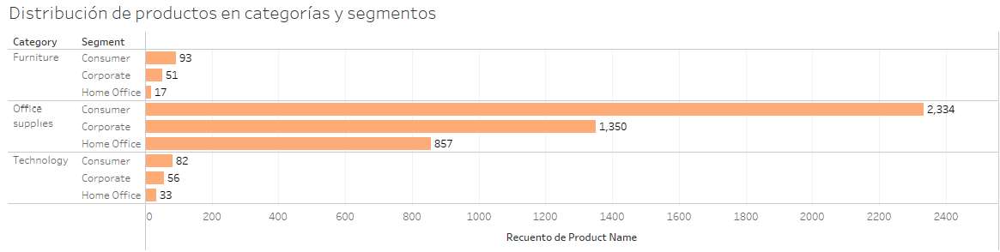

- Total de Ventas y Beneficios por categoría y segmento.
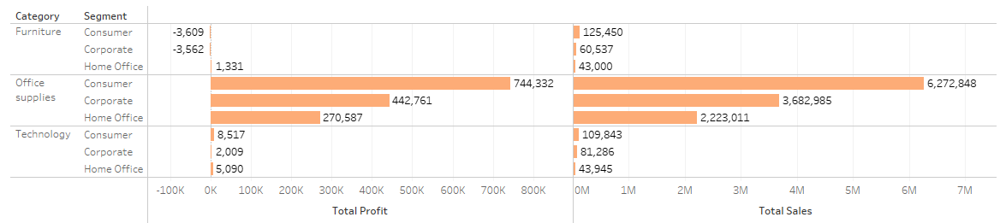

- Número de productos únicos vendidos por segmento.
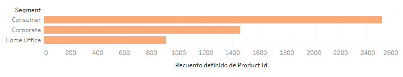

- Análisis de rentabilidad por producto y categoría.

**2. Visualización de Variables Categóricas**

- Comparación de ventas por categoría de productos a lo largo del tiempo.
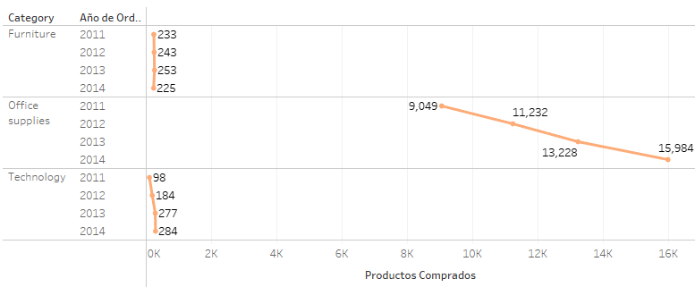

- Evolución de ventas por categoría.
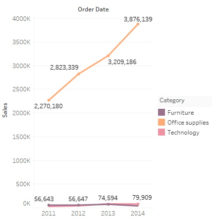

- Relación entre ventas y ganancias por segmento.
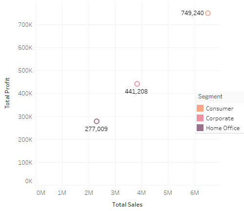

**3. Medidas de Tendencia Central**

- Aplicación de medidas de tendencia central (media, mediana, moda).

**4. Distribución de Datos**

- Distribución del número de pedidos.
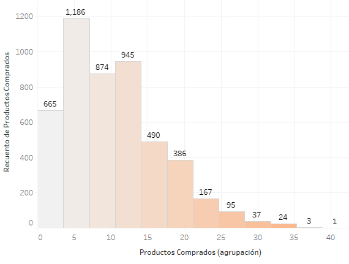

**5. Medidas de Dispersión**

- Cálculo de desviación estándar de las ventas.
- Varianza en las ventas por categoría.

**6. Análisis Temporal**

- Comparación de modos de envío y su impacto en ventas.
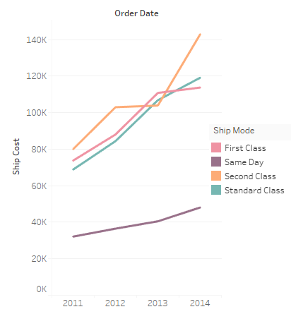

## Dashboard 

Puedes acceder a mi dashboard en Tableu haciendo clic [aquí](https://public.tableau.com/app/profile/veronica.yadira.dom.nguez/viz/SuperstoreDashboard_17257697542560/Dashboard1?publish=yes).

## Resultados

**Segmentos de clientes**

El segmento "Consumer" genera la mayor proporción de ventas (51.47%), seguido por "Corporate" (30.25%) y "Home Office" (18.27%). Esto sugiere que la mayoría de las ventas provienen de clientes individuales.

- **Productos Comprados a lo Largo del Tiempo (2011-2014):**

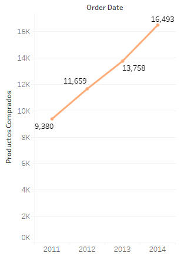

- **Año 2011:** 9,380 productos comprados.
- **Año 2012:** 11,659 productos comprados.
- **Año 2013:** 13,758 productos comprados.
- **Año 2014:** 16,493 productos comprados.
Se muestra un crecimiento sostenido en el número de productos comprados entre 2011 y 2014, con un incremento de aproximadamente 76% en el periodo.

- **Análisis de Rentabilidad por Categoría:**

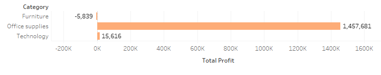

- **Muebles (Furniture):** -5,839 (pérdida).
- **Suministros de Oficina (Office Supplies):** 1,457,681 de ganancia.
- **Tecnología (Technology):** 15,616 de ganancia.

La categoría más rentable es "Office Supplies", con una ganancia significativa en comparación con las otras categorías, mientras que "Furniture" genera pérdidas.

- **Ventas Totales a lo Largo del Tiempo (2011-2014):**

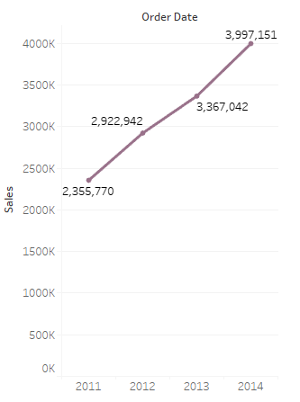

- **Año 2011: ** $2,355,770 en ventas.
- **Año 2012:** $2,922,942 en ventas.
- **Año 2013:** $3,367,042 en ventas.
- **Año 2014:** $3,997,151 en ventas.

Se muestra un incremento constante en las ventas, alcanzando un aumento del 69% de 2011 a 2014.

- **Comparación de Modos de Envío (Ship Cost vs Order Date):**

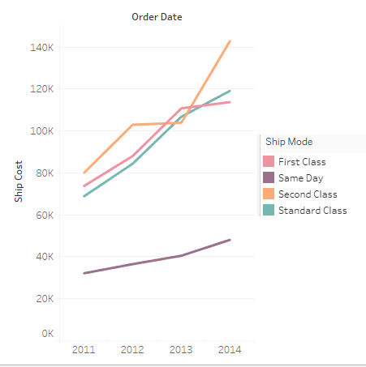

A lo largo de los años, se observa un incremento en los costos de envío, independientemente del modo de envío. Sin embargo, el envío "Second Class" y "Standard Class" muestran un aumento más significativo en comparación con "Same Day" y "First Class". El costo de envío más alto en 2014 corresponde a "Second Class", lo que podría deberse a un incremento en la demanda o cambios en los costos operacionales.

- **Distribución de Productos por Categoría y Segmento:**

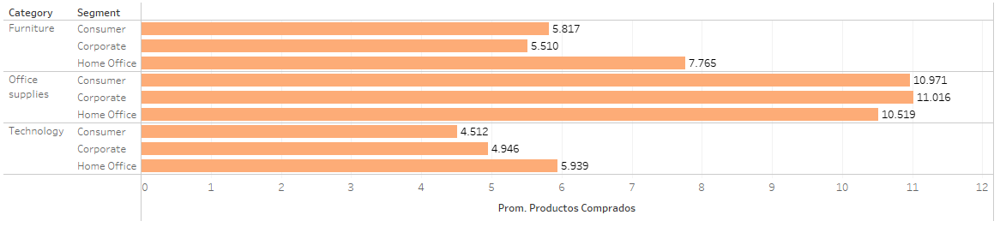

En la categoría "Office Supplies", el segmento "Consumer" representa la mayor proporción de productos vendidos, mientras que en "Technology" y "Furniture", los segmentos están más equilibrados. Esto sugiere que los consumidores tienden a comprar más suministros de oficina en comparación con las empresas, mientras que en tecnología y muebles, tanto consumidores como empresas contribuyen de manera significativa a las ventas.

-**Promedio de Costos de Envío por Segmento y Categoría:**

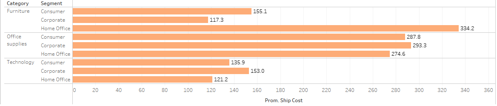

Los envíos para la categoría de "Office Supplies" en el segmento "Home Office" tienen los costos promedio más altos, mientras que los envíos para "Furniture" en el segmento "Corporate" tienen los costos más bajos. Esto podría estar relacionado con el tamaño y peso de los productos en cada categoría.

- **Relación entre Ventas Totales y Ganancias por Segmento:**

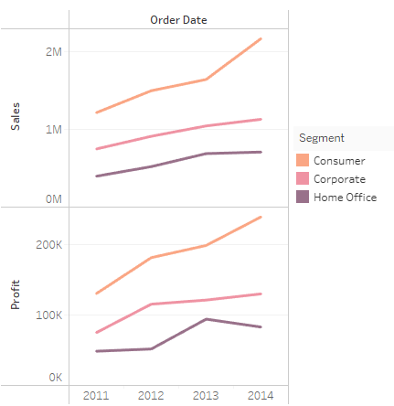

El segmento "Consumer" tiene tanto las ventas totales más altas como las ganancuas más elevadas, mientras que "Home Office" tiene las ventas y las ganancias más bajas. Esto sugiere que los consumidores son los principales motores de los ingresos y ganancias en comparación con las empresas.

## Recomendaciones

- Fortalecer la presencia en el segmento "Consumer" con estrategias de fidelización y programas de recompensas para mantener y aumentar la participación en este mercado.

- Reducir los costos de envío ofreciendo incentivos para modos de envío más económicos, negociando con proveedores logísticos o considerando alternativas como envíos agrupados.

- Mejorar la rentabilidad de "Furniture" ajustando la estrategia de precios y explorando formas de reducir costos operacionales o de almacenamiento.

- Aprovechar el crecimiento en "Office Supplies" con ofertas especiales para clientes recurrentes y ampliando el inventario de productos en demanda dentro de esta categoría.

## Conclusiones
- **El segmento "Consumer" es clave:** El segmento "Consumer" es el principal motor de las ventas y beneficios, representando más de la mitad de las ventas totales. Este segmento debe ser el enfoque principal en futuras estrategias de marketing y ventas.

- **Crecimiento Sostenido en las Ventas:**

Las ventas han mostrado un crecimiento constante del 69% de 2011 a 2014, lo que indica una fuerte demanda y un mercado en expansión. Sin embargo, es crucial continuar monitorizando los costos de envío, ya que estos pueden afectar la rentabilidad si no se gestionan adecuadamente.
- **Rentabilidad Alta en "Office Supplies", pero Problemas en "Furniture":**

La categoría de "Office Supplies" es la más rentable y debería seguir siendo priorizada. Sin embargo, las pérdidas en "Furniture" requieren una reevaluación, ya que están afectando la rentabilidad general de la empresa. 

- **Aumento en los Costos de Envío:**

Los costos de envío han crecido considerablemente, especialmente para envíos de "Second Class" y "Standard Class". La empresa debería explorar opciones para optimizar los costos de envío y negociar mejores tarifas con proveedores logísticos.

## Recursos

### Presentación
Puedes acceder a mi presentación clic [aquí](https://www.canva.com/design/DAGQMBA8dyA/0L4dwyiVR9RJXHxNNZle-A/view?utm_content=DAGQMBA8dyA&utm_campaign=designshare&utm_medium=link&utm_source=editor).
